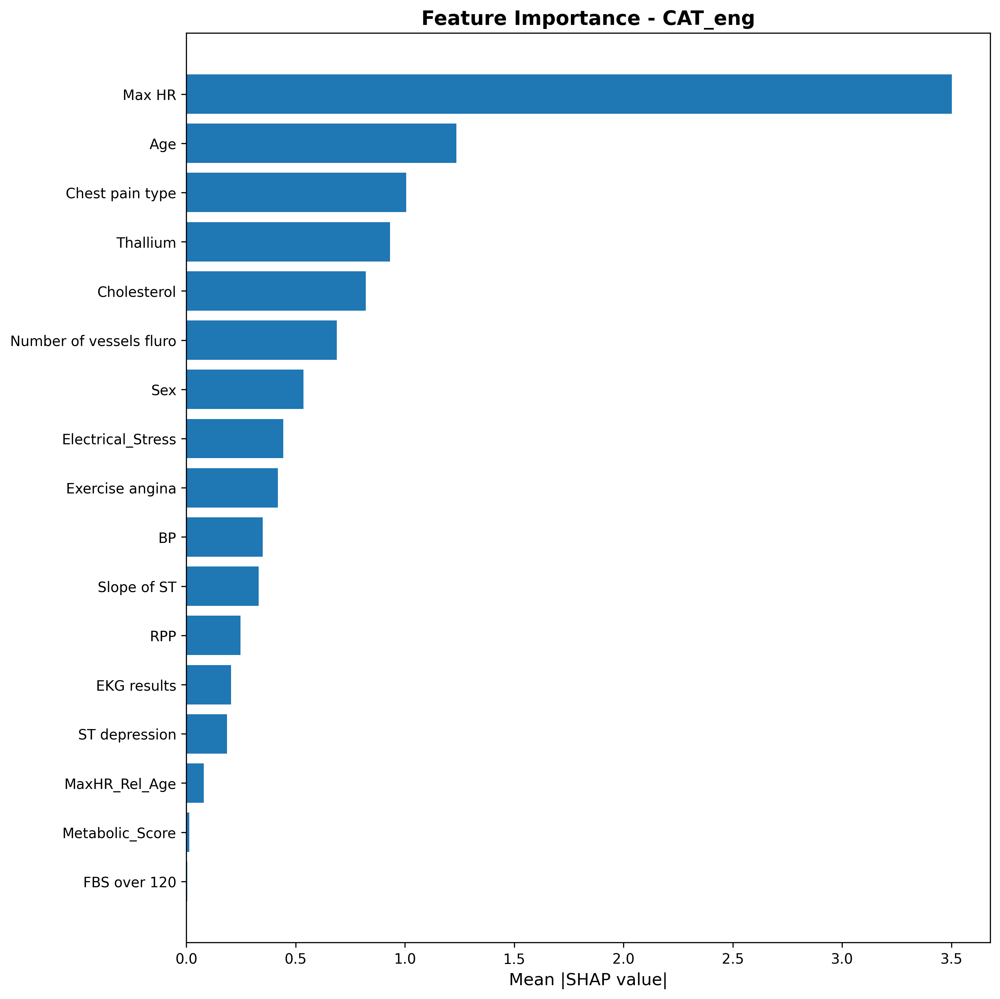

# Heart Disease Prediction - MLOps Pipeline

[](https://github.com/yourusername/heart-disease-prediction/actions/workflows/ci.yml)
[](https://www.python.org/downloads/)
[](https://github.com/astral-sh/ruff)
[](https://opensource.org/licenses/MIT)

Production-ready ML pipeline for Heart Disease Prediction from [Kaggle Playground Series S6E2](https://www.kaggle.com/competitions/playground-series-s6e2).

## Highlights

- **Multiple Models**: Random Forest, LightGBM, XGBoost, CatBoost comparison
- **Experiment Tracking**: MLflow integration for reproducible experiments
- **Automated CI/CD**: GitHub Actions with lint, type-check, and tests
- **Production API**: FastAPI endpoint for model serving
- **Best Score**: 0.9563 AUC (CatBoost with feature engineering)

## Project Structure

```
heart-disease-prediction/
├── src/
│   ├── train.py              # Main training script with MLflow
│   ├── train_baseline.py     # Baseline model (Random Forest)
│   ├── ensemble.py           # Model ensembling
│   ├── stacking.py           # Stacking ensemble
│   ├── shap_analysis.py      # Model interpretability (SHAP)
│   ├── correlation_analysis.py
│   ├── api/
│   │   └── main.py           # FastAPI prediction endpoint
│   └── utils/
│       └── mlflow_utils.py   # MLflow tracking utilities
├── tests/
│   ├── test_features.py      # Feature engineering tests
│   └── test_pipeline.py      # Pipeline tests
├── notebooks/
│   └── 01_initial_eda.ipynb  # Exploratory Data Analysis
├── data/                     # Dataset (not tracked)
├── output/
│   ├── models/               # Trained models
│   └── submissions/          # Kaggle submissions
├── .github/workflows/ci.yml  # CI/CD pipeline
├── pyproject.toml            # Project configuration
├── Makefile                  # Development commands
├── Dockerfile                # Container configuration
└── docker-compose.yml
```

## Quick Start

### Installation

```bash
# Clone repository
git clone https://github.com/yourusername/heart-disease-prediction.git
cd heart-disease-prediction

# Create virtual environment
python -m venv .venv
source .venv/bin/activate  # Linux/Mac
# .venv\Scripts\activate   # Windows

# Install dependencies
make install-dev
```

### Training

```bash
# Train CatBoost with feature engineering (default)
make train

# Train specific model
python -m src.train --model cat --engineered --tune --n-trials 50

# Train with K-Fold cross-validation
python -m src.train --model cat --engineered --tune --folds 5

# Available models: rf, lgbm, xgb, cat
```

### MLflow Experiment Tracking

```bash
# Start MLflow UI
make mlflow-ui

# Open http://localhost:5000 in browser
```

### API Server

```bash
# Run locally
make api

# Run with Docker
make docker-build
make docker-run
```

## MLOps Features

### 1. Experiment Tracking (MLflow)

All training runs are automatically logged to MLflow:

- **Parameters**: model type, hyperparameters, feature engineering flags
- **Metrics**: AUC score, CV scores per fold
- **Artifacts**: trained models, feature importance

```python
from src.utils.mlflow_utils import MLflowTracker

tracker = MLflowTracker(experiment_name="heart-disease")
with tracker.start_run(run_name="catboost-v1"):
    tracker.log_params({"learning_rate": 0.1, "depth": 6})
    tracker.log_metrics({"auc": 0.95})
```

### 2. Code Quality

```bash
# Lint with ruff
make lint

# Format code
make format

# Type check with mypy
make type-check

# Run tests
make test

# Run tests with coverage
make test-cov
```

### 3. CI/CD Pipeline

GitHub Actions workflow includes:

- **Lint & Format**: ruff check and format
- **Type Check**: mypy static analysis
- **Tests**: pytest with coverage
- **Build**: Package build verification
- **Docker**: Container build test

### 4. Hyperparameter Tuning (Optuna)

```bash
# Run 100 trials of hyperparameter optimization
python -m src.train --model cat --tune --n-trials 100
```

## Model Performance

| Model | Features | Tuning | CV AUC |
|:------|:---------|:-------|:-------|
| **CatBoost** | Engineered | 100 trials | **0.9554** |
| XGBoost | Engineered | 100 trials | 0.9552 |
| LightGBM | Engineered | 100 trials | 0.9552 |
| Random Forest | Engineered | 100 trials | 0.9476 |
| Baseline RF | Numeric only | Default | 0.8578 |

**Key Improvement**: Adding categorical features improved AUC by +10.5% (0.8578 → 0.9476)

## Feature Engineering

### Base Features (13 total)

**Numerical (6)**:
- Age, BP, Cholesterol, Max HR, ST depression, Number of vessels fluro

**Categorical (7)**:
- Sex, Chest pain type, FBS over 120, EKG results, Exercise angina, Slope of ST, Thallium

### Engineered Features (7)

| Feature | Formula | Description |
|:--------|:--------|:------------|
| Rate_Pressure_Product | BP × Max HR | Myocardial oxygen demand |
| Electrical_Stress | ST depression × Slope of ST | Cardiac electrical stress |
| Metabolic_Score | Sum of risk factors | Metabolic risk composite |
| MaxHR_Rel_Age | Max HR / (220 - Age) | Heart rate reserve |
| MaxHR_x_Age | Max HR × Age | Age-adjusted heart capacity |
| BP_x_Cholesterol | BP × Cholesterol | Combined cardiovascular risk |
| Age_Bin | Age // 10 | Decade-based age grouping |

## Model Interpretability

SHAP analysis reveals top predictive features:

1. **Max HR** - Most important predictor
2. **Age** - Strong age-related risk
3. **Chest pain type** - Symptom-based classification
4. **Thallium** - Diagnostic test result



## API Usage

```bash
# Start server
uvicorn src.api.main:app --reload

# Make prediction
curl -X POST "http://localhost:8000/predict" \
  -H "Content-Type: application/json" \
  -d '{"Age": 63, "Sex": 1, "BP": 145, "Cholesterol": 233, ...}'
```

## Development

### Pre-commit Hooks

```bash
# Install hooks
pre-commit install

# Run manually
pre-commit run --all-files
```

### Adding New Models

1. Add model initialization in `src/train.py:get_pipeline()`
2. Add hyperparameter search space in `optimize_hyperparameters()`
3. Add tests in `tests/test_pipeline.py`

## License

MIT License - see [LICENSE](LICENSE) for details.

## Acknowledgments

- [Kaggle Playground Series S6E2](https://www.kaggle.com/competitions/playground-series-s6e2)
- [CatBoost Documentation](https://catboost.ai/docs/)
- [MLflow Documentation](https://mlflow.org/docs/latest/index.html)
